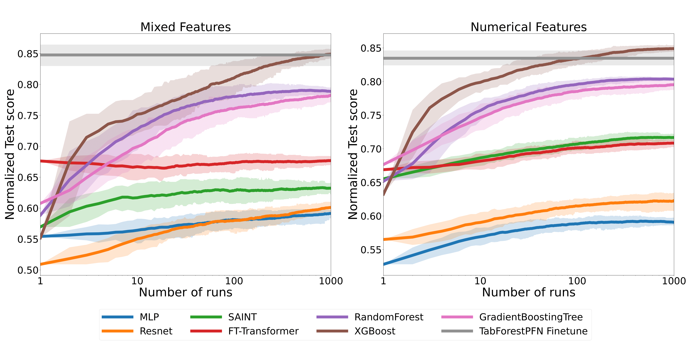
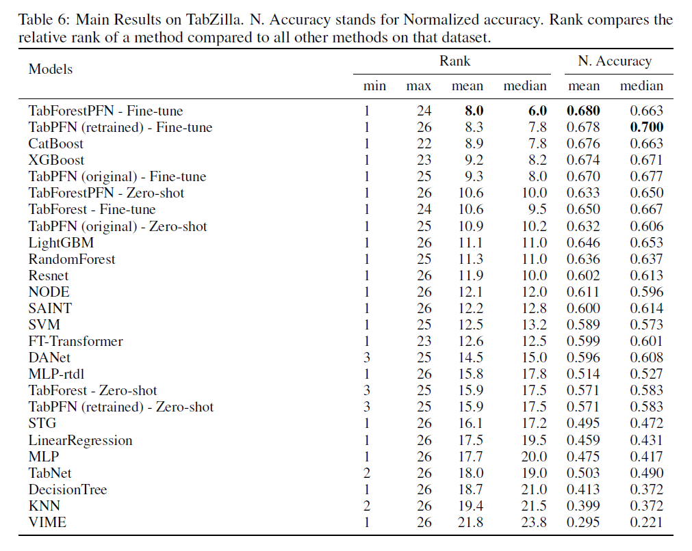
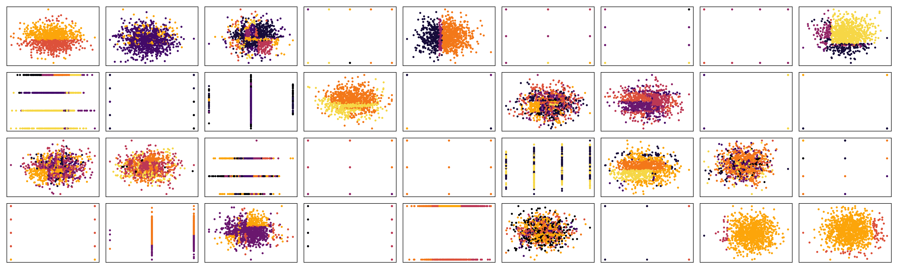

# Why In-Context Learning Transformers are Tabular Data Classifiers

This repository is the official implementation of [Why In-Context Learning Transformers are Tabular Data Classifiers](--arxiv link--). 


## Requirements

To install requirements:

```setup
pip install -r requirements.txt
pip install .
```

There is also requirements_frozen.txt that contains the exact versions of the packages used in the paper. 


## Easy Example


## Preprocessing

This codebase uses public results from the following papers:  
WhyTrees (http://arxiv.org/abs/2207.08815)  
TabZilla (http://arxiv.org/abs/2305.02997)  

To run any results, we require the following results to be downloaded and placed in the `data` folder:  
WhyTrees: `benchmark_total.csv`   (https://figshare.com/ndownloader/files/40081681)     
TabZilla: `metadataset_clean.csv`  (https://drive.google.com/drive/folders/1cHisTmruPHDCYVOYnaqvTdybLngMkB8R)   
See `tabularbench/utils/paths_and_filenames.py` for the exact paths and filenames.   

If the links do not work, we suggests to refer to the github pages of the above papers:  
WhyTrees: https://github.com/LeoGrin/tabular-benchmark  
TabZilla: https://github.com/naszilla/tabzilla  

When the above results are present, you can run the preprocessing script as follows:  

```preprocess
python preprocess.py
```

The preprocessing will convert the results from the above papers into a format that can be used by our codebase.  
It will also download the necessary datasets for the experiments in the paper.  
Datasets are placed in the `data/datasets` folder.  
Preprocessing can take a few hours to run, depending on the internet connection and the machine.  

## Code Overview

The code has three points of entry:  

1. `tabularbench/core/run_experiments.py` is used to run one model on multiple cross-validation splits of one dataset
2. `main.py` is used to run one model on multiple cross-validation splits of a collection of datasets called a 'benchmark'. This file can be used to evaluate pre-trained models or to train models from scratch. Internally, it will run `run_experiments.py` multiple times. The configuration file that determines the settings is given in `config/main.yaml`.
3. `pretrain.py` is used to pretrain an In-Context Learning Transformer on synthetic data. During the evaluation and test phase it will run a function similar to `main.py`. The configuration file that determines the settings is given in `config/pretrain.yaml`.

All our output of our trained models is saved in the `outputs_done` folder.  
If you want to exactly replicate the results in the paper, you can use the configuration files in this folder.

## Pretrained Weights

We provide the pretrained weights of TabForest, TabPFN (retrained) and TabForestPFN here:  

- [Google Drive](https://drive.google.com/drive/folders/151koPna9G8dvCW9gfnWJIHzoG6tMOq9t?usp=sharing)  

After downloading the weights, you can place them in the `weights` folder.  
Make sure to update the configuration file to point to the correct weights file.  

The configuration files for these models can be found in the `outputs_done` folder:  
TabForest: `foundation_forest_big_300k`  
TabPFN: `foundation_tabpfn_big_300k`  
TabForestPFN: `foundation_mix_600k_finetune`  

All three models work with our reimplementation of the TabPFN model. The original TabPFN model weights are not included in the google drive folder.  

In our code, 'TabPFN' refers to the original tabpfn model, and 'Foundation' refers to our reproduction of the model.
The name 'TabSGFD' is an old name of 'TabForest'.
The retrained TabPFN model is often refered to as 'foundation_tabpfn', while the original is 'tabpfn_orig' or just tabPFN.
The ensemble of TabForest and TabPFN is often refered to as 'foundation_mix'.  

If you want to reproduce the analysis of ablations that use a small model size, you have to rerun the pretraining.  

## Results

Our model is tested on:  
WhyTrees (http://arxiv.org/abs/2207.08815)  
TabZilla (http://arxiv.org/abs/2305.02997)  

All analysis can be found in the `notebooks` folder, often based on the information in the `outputs_done` folder.  

### WhyTrees



### TabZilla




## Synthetic Data

The synthetic data is showcased in the `notebooks/synthetic_generators_showcase` file.  
It can produce images for the forest dataset generator and the tabpfn dataset generator like these:  




## Contributing

>📋  Pick a licence and describe how to contribute to your code repository. 
